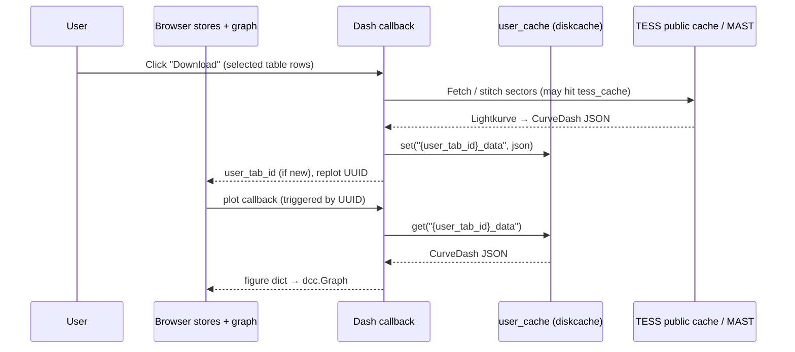
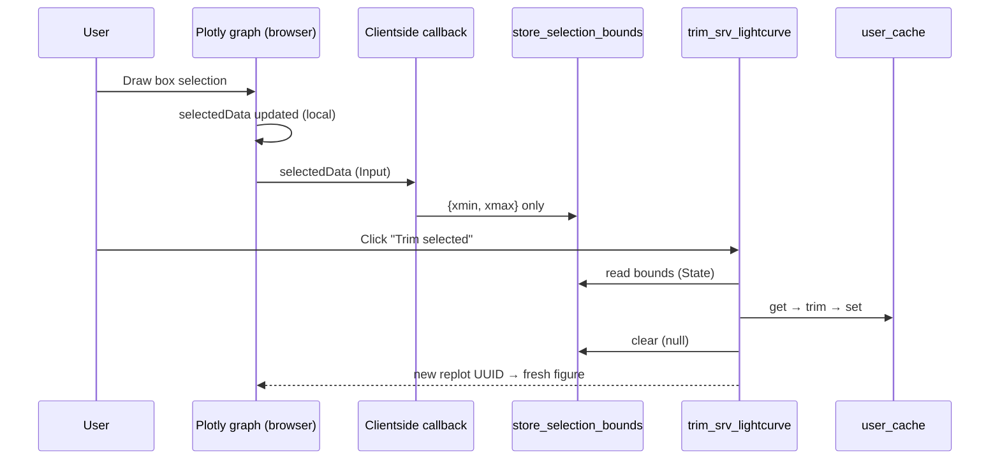
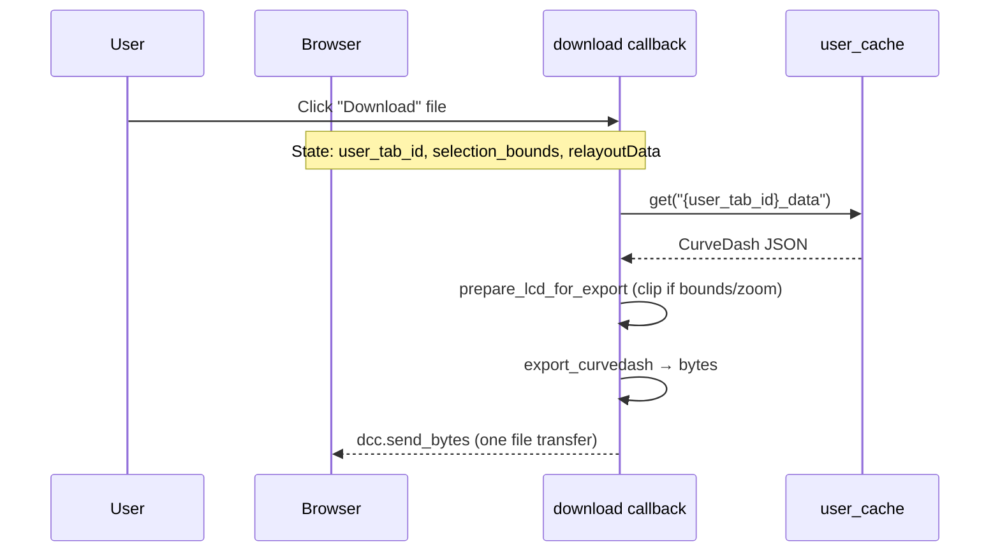

# Caching Architecture

This document describes the caching architecture and strategies implemented in this project to balance two competing requirements:
1. **Public Data Caching (Shared Archive Cache):** Reducing external network requests and processing for identical queries by caching public, immutable physical observations (such as TESS search results, Target Pixel Files, and Lightcurves) so multiple users can reuse them.
2. **Private Data Caching (User Session Cache):** Enabling low-latency user sessions by caching large, user-specific data (uploads, deleted outliers, locally processed lightcurves) on the server side using a unique session UUID, rather than transferring massive payloads back and forth to the client via `dcc.Store`.

For the **experimental hybrid client–server design** used on the TESS archive lightcurve page — why the server holds the array while Plotly and lightweight stores stay in the browser — see [§2](#2-hybrid-clientserver-architecture-for-interactive-lightcurves-experimental).

---

## 1. Caching Subsystems and Organisation

The caching mechanisms are split into three dedicated subsystems depending on the scope, ownership, and source of the data:

```text
                               ┌────────────────────────────────┐
                               │       Incoming Request         │
                               └────────────────┬───────────────┘
                                                │
                       ┌────────────────────────┴────────────────────────┐
                       ▼                                                 ▼
             [ Public Data Search ]                           [ User-Specific View/Edit ]
                       │                                                 │
            ┌──────────┴──────────┐                            ┌─────────┴─────────┐
            ▼                     ▼                            ▼                   ▼
     { Cache Hit? }        { Cache Miss? }              { Cache Hit? }      { Cache Miss? }
            │                     │                            │                   │
   ┌────────┴────────┐   ┌────────┴────────┐          ┌────────┴────────┐  ┌───────┴───────┐
   │ Read from Local │   │ Fetch from MAST │          │ Read from       │  │ User must     │
   │ TESS/ASAS Cache │   │ / VO Services   │          │ SQLite-backed   │  │ download /    │
   └─────────────────┘   └────────┬────────┘          │ user_cache      │  │ upload first  │
                                  │                   └─────────────────┘  └───────────────┘
                                  ▼
                         Cache on Disk for
                          Future Sharing
```

### A. The User Session Cache (`user_cache`)
* **Underlying Technology:** SQLite-backed `diskcache` (multi-process and thread-safe).
* **Location Configuration:** Specified by the `USER_CACHE_DIR` environment variable.
* **Role:** Stores user-specific, customised, or uploaded lightcurve data. TESS lightcurves are represented as high-level scientific curves (`CurveDash` instances) and can be quite large. Passing these data payloads to the browser via `dcc.Store` would cause severe network and browser rendering lags. Instead, the application generates a unique `user_tab_id` and caches the data on the server.
* **Scope (experimental):** At present, this **server-side user session cache** is used on **one page only** — `skvo_veb/pages/lightcurve_tess_srv.py` (TESS archive lightcurve tool). Other pages (for example `tess_cutout.py`) still hold working lightcurves in browser `dcc.Store` session storage where the design predates this experiment or payload sizes are manageable. See [§2 Hybrid Client–Server Architecture](#2-hybrid-clientserver-architecture-for-interactive-lightcurves-experimental) for the full rationale and data-flow diagrams.
* **Key Implementation Details:**
  * **Tab UUID Generation:** When a user initialises the page, a unique UUID (`user_tab_id`) is generated on the server and stored in a lightweight `dcc.Store` on the client.
  * **Replot trigger UUID:** `store_tess_lightcurve_lc_srv` holds **only a random UUID**, not the lightcurve JSON. Dependent callbacks fire when this value changes after cache writes.
  * **Sliding Expiration:** To prevent server-disk exhaustion from inactive sessions, the cache uses a **sliding expiration window** of 24 hours (`expire=86400` seconds). Every read operation refreshes this timer.
  * **Cache key:** `{user_tab_id}_data` → serialised `CurveDash` JSON string.

### B. The TESS Public Data Cache (`tess_cache`)
* **Underlying Technology:** Custom file-based key-value wrapper (`skvo_veb/utils/tess_cache.py`).
* **Location Configuration:** Specified by the `TESS_CACHE_DIR` environment variable.
* **Role:** Caching raw public data retrieved from MAST (NASA's Mikulski Archive for Space Telescopes) to optimise search and retrieval times.
* **Key Implementation Details:**
  * **Query-Based Hashing:** Caching search queries (`SearchResult` tables) using standard serialisation (`dill`) under filenames deterministically mapped to the query parameters using an MD5 hash of the parameters.
  * **FITS Storage:** High-level Target Pixel Files (TPF) and Full Frame Image (FFI) cutouts are stored as standard `.fits` files (`save_tpf_fits`, `save_ffi_fits`).
  * **Corrupted Cache Healing:** If a download is corrupted (e.g., incomplete network streams), the wrapper automatically resolves the file path on disk, clears the corrupted file, and retries the MAST query, ensuring the cache is self-healing.

### C. The ASAS-SN Public Data Cache
* **Underlying Technology:** Direct file serialization (`pickle`).
* **Location Configuration:** Specified by the `ASASSN_CACHE_DIR` environment variable.
* **Role:** Caches ASAS-SN physical lightcurves under `asassn_lc_{gaia_id}.pkl` using `pandas.DataFrame.to_pickle` to avoid repeated remote VO service lookups.

---

## 2. Hybrid Client–Server Architecture for Interactive Lightcurves (Experimental)

This section explains **why** the TESS archive lightcurve page (`lightcurve_tess_srv.py`) keeps the scientific dataset on the server while still using browser-side Plotly graphs and lightweight `dcc.Store` components — and **how** data moves between the two tiers without shipping tens of thousands of points on every click.

### 2.1 The Problem We Are Solving

Interactive lightcurve analysis combines two opposing requirements:

| Requirement | Why it pushes toward the **server** | Why it pushes toward the **client** |
| :--- | :--- | :--- |
| **Large datasets** | TESS sectors routinely contain **tens of thousands** of cadence points; stitched multi-sector curves can be larger still. Serialising a `CurveDash` DataFrame to JSON often means **megabytes per round-trip**. | — |
| **Heavy computation** | Phase folding, periodograms (Lomb–Scargle), stitching, flux normalisation, and trim/export pipelines run in Python with Astropy/Lightkurve — impractical in the browser. | — |
| **Responsive graph UI** | — | Box select, zoom, pan, and hover must feel **instant**. Plotly renders traces in the browser; selection rectangles are drawn locally before any network call. |
| **Multi-user production** | Apache serves concurrent workers; a shared SQLite-backed `diskcache` is process-safe. | Each browser tab keeps its own Plotly figure and small session stores. |

Putting the full lightcurve into `dcc.Store` would satisfy session persistence but would **re-download the entire array on every callback** that lists the store as `Input` or `State`. That breaks responsiveness and violates the project rule to keep `dcc.Store` payloads under ~5 MB for UI state only.

The experimental design on `lightcurve_tess_srv.py` therefore **splits responsibilities**:

```text
  ┌─────────────────────────────────────────────────────────────────────────┐
  │                         BROWSER (per tab)                               │
  │                                                                         │
  │   dcc.Store (session)              Plotly dcc.Graph                     │
  │   ┌──────────────────────┐        ┌──────────────────────────────┐      │
  │   │ user_tab_id (UUID)   │        │ figure  ← traces for display │      │
  │   │ replot UUID (trigger)│        │ selectedData  (box select)   │      │
  │   │ selection_bounds     │        │ relayoutData  (zoom/pan)      │      │
  │   │   {xmin, xmax}       │        │ clickData     (point pick)   │      │
  │   │ metadata (axis ranges)│        └──────────────────────────────┘      │
  │   └──────────┬───────────┘                    │                         │
  │              │ lightweight IDs / bounds        │ interaction events      │
  └──────────────┼─────────────────────────────────┼─────────────────────────┘
                 │                                 │
                 │  Dash callbacks (HTTP/WebSocket)│
                 ▼                                 ▼
  ┌─────────────────────────────────────────────────────────────────────────┐
  │                         SERVER (shared workers)                         │
  │                                                                         │
  │   user_cache (diskcache / SQLite)                                       │
  │   ┌──────────────────────────────────────────────────────────────┐      │
  │   │  key: "{user_tab_id}_data"  →  CurveDash JSON (full LC)      │      │
  │   └──────────────────────────────────────────────────────────────┘      │
  │        ▲ read/write          ▲ read/write          ▲ read only          │
  │        │                     │                     │                    │
  │   plot │ trim │ fold │ periodogram │ export │ upload/stitch download   │
  │        │                     │                     │                    │
  │   utils/ (lc_bridge, lc_interaction, tess_lc_builder, curve_dash)      │
  └─────────────────────────────────────────────────────────────────────────┘
```

### 2.2 Design Principles

1. **One canonical copy per tab on the server.** All mutations (trim, fold, upload append, re-stitch) read → modify → write `user_cache`. The browser never holds the authoritative dataset.
2. **Client stores carry keys and UI state only.** Typical payloads: a 36-character UUID, a 16-byte `{xmin, xmax}` dict, or cached axis ranges — not the lightcurve table.
3. **Plotly owns interactivity until a button asks the server to act.** Box selection updates the graph immediately; only `{xmin, xmax}` is copied into a store (clientside callback). Trim, export, and periodogram are explicit server actions keyed by `user_tab_id`.
4. **Replot via trigger, not data mirror.** After a server-side change, callbacks return a **new random UUID** to `store_tess_lightcurve_lc_srv`. The plot callback reads the cache and pushes a fresh `figure` dict to the graph — the store value itself is meaningless except as a change detector.
5. **Minimise cross-tier traffic on the hot path.** Zoom and pan update `relayoutData` locally. Export reads `relayoutData` or `selection_bounds` only when the user clicks Download — not on every pan event.

### 2.3 What Lives Where (TESS archive page)

| Asset | Location | Approx. size | Purpose |
| :--- | :--- | :--- | :--- |
| Full `CurveDash` (JD, flux, errors, UI columns) | **Server** `user_cache` | 100 KB – several MB | Canonical science state |
| `user_tab_id` | **Client** `dcc.Store` (session) | ~36 B | Lookup key for server cache |
| Replot trigger UUID | **Client** `dcc.Store` (session) | ~36 B | Signal that cache changed → rebuild figure |
| Selection bounds `{xmin, xmax}` | **Client** `dcc.Store` (session) | ~16 B | Trim/export window in display coordinates |
| Axis range metadata | **Client** `dcc.Store` (session) | ~100 B | Fallback export clip when graph relayout is stale |
| Plotly `figure` (x, y arrays) | **Client** `dcc.Graph` | Proportional to visible trace points | Rendering + box/zoom interaction |
| Plotly `selectedData` / `relayoutData` | **Client** graph props | Event-sized | Interaction; distilled before server use |
| Exported file bytes | **Server → client** one-shot | File size | `dcc.Download` / `send_bytes` |

**Important:** The Plotly figure **does** contain x/y arrays sent from the server when the plot callback runs. That is unavoidable for rendering. The optimisation is to avoid **re-sending the full serialised DataFrame on every unrelated callback** and to never mirror it into `dcc.Store`.

### 2.4 End-to-End Data Flows

#### A. Load / stitch lightcurve (background callback)



Heavy download and stitching stay on the server. The browser receives a **UUID change** and a **Plotly figure**, not the raw cache blob in a store.

#### B. Box select → trim (clientside distill + server mutate)



Trim **removes** the interval inside the box on the server. Bounds are **cleared after trim** so a subsequent export does not clip to the removed window (see `lc_interaction.prepare_lcd_for_export`).

#### C. Export to user's computer



Export is intentionally a **server round-trip**: clipping and VOTable generation belong in `utils/`. Only the finished file crosses to the client.

### 2.5 Comparison: Experimental Server Cache vs. Session Store Pages

| Aspect | `lightcurve_tess_srv.py` (**experimental**) | `tess_cutout.py` (session store) |
| :--- | :--- | :--- |
| Canonical LC location | Server `user_cache` | Client `store_tess_cutout_lightcurve` (session JSON) |
| Typical point count | Very large (archive sectors, stitch) | Moderate (single cutout aperture LC) |
| Store payload | UUID + bounds + metadata | Full serialised `CurveDash` |
| Trim | Server callback + cache write | Clientside JS mutates store JSON |
| Plot refresh | Server builds figure from cache | Server builds figure from store State |
| When to prefer | Heavy arrays, periodogram, multi-sector stitch | Smaller LC tied to pixel-mask workflow on same page |

Both pages share the same **selection bounds** pattern: clientside extraction of `{xmin, xmax}` from Plotly `selectedData` so server callbacks never receive the full selection payload.

### 2.6 Why Not Pure Server or Pure Client?

| Approach | Failure mode for our use case |
| :--- | :--- |
| **Full LC in `dcc.Store`** | Every callback serialises/deserialises 10⁴–10⁵ points; browser memory pressure; slow JSON parse; violates AGENTS.md store size guidance. |
| **Pure server, no Plotly client state** | Cannot box-select or zoom without a round-trip per mouse event; unusable UX. |
| **Pure clientside science** | No Astropy/Lightkurve/Lomb–Scargle; cannot reuse `utils/`; untenable for correct astronomy. |
| **Hybrid (current experiment)** | Large state and math on server; interaction on client; cross-tier messages limited to UUIDs, bounds, and figure updates. |

### 2.7 Operational Notes

* **Session vs. cache lifetime:** `dcc.Store(storage_type='session')` survives page refreshes within the same browser tab but is cleared when the tab closes. `user_cache` entries expire after **24 hours of inactivity** (sliding window refreshed on every read). A user can therefore lose server cache while the tab UUID store still holds an ID — the plot callback then raises a friendly “please download again” error.
* **Concurrency:** Multiple Apache workers share one `USER_CACHE_DIR`; SQLite WAL makes concurrent reads/writes safe for different `user_tab_id` keys.
* **Future direction:** If the experiment proves stable, the same `{user_tab_id}` + `user_cache` pattern could be extended to other high-volume pages; until then, treat `lightcurve_tess_srv.py` as the reference implementation documented here.

Related detail on trim/export clipping and bridge export paths: [`docs/lightcurve_data_flow.md`](lightcurve_data_flow.md) §6.

---

## 3. Local Debug Mode vs. Production (Apache) Mode

The system handles differences between local development and an Apache production environment using environment-level configurations and adaptive imports:

### A. Local Debug Mode (`main.py` / Standalone Execution)
* **Environment Variables:** Loaded from the local `.env` file, setting `USE_REDIS=false` and `DEBUG_LOCAL=1`.
* **Background Processing:** In `config.py`, when `USE_REDIS` is `False`, the app registers `DiskcacheManager` as the global background callback manager.
* **Standalone Safety:** When running `tess_cutout.py` or `lightcurve_tess_srv.py` directly, a local standalone `Dash` server is instantiated. If `DISK_CACHE` / `DISK_CACHE_LOCAL` is configured as `False`, the background callbacks are forced to run **synchronously** in the foreground (`background_callback = False`). This makes it simple to debug issues since stack traces print directly to the terminal, and standard debuggers can step through code without multi-process complications.

### B. Production Mode (Apache WSGI / `deployment/skvo_veb.wsgi`)
* **Environment Variables:** Loaded from `/var/www/flask/.env`.
* **Background Processing:** Under Apache, multiple server worker processes handle incoming requests. Long-running calls (downloads, stitching) are offloaded asynchronously. If `USE_REDIS` is set to `True` in production, the application registers `CeleryManager` backed by Redis, distributing background tasks safely to standalone Celery workers so Apache worker processes do not timeout or block.
* **Process Concurrency Protection:** Apache serves multiple clients concurrently through separate worker processes.
  * **Diskcache Multi-Process Safety:** The `user_cache` uses SQLite-backed `diskcache`. SQLite uses write-ahead logging (WAL) and POSIX file locking, making it completely process-safe and thread-safe. Multiple Apache processes can safely write session data to the same `USER_CACHE_DIR` without corrupting the database.
  * **Module-Reload Persistence:** Under Apache, processes are spawned and recycled periodically. If the cache was cleared on module initialisation, a recycled worker process would wipe out all user-session caches. The application prevents this by specifically disabling cache clearing during imports when running in production.

---

## 4. Caching Flows & Comparison Summary

| Feature | TESS/ASAS-SN Public Cache | User Session Private Cache (`user_cache`) |
| :--- | :--- | :--- |
| **Target Data** | Public MAST / ASAS-SN physical files, metadata, queries. | User uploads, phase folding state, deleted points, current view state. |
| **Storage Medium** | Dill / Pickled frames, raw `.fits` files. | SQLite database via `diskcache`. |
| **Access Key** | Deterministic MD5 hash of query arguments. | Unique, browser-persisted `user_tab_id` (UUID). |
| **Sharing** | Publicly shared across all user sessions. | Private to each browser tab/session. |
| **Expiration** | Infinite (data is immutable). | Sliding 24-hour expiration window. |
| **Apache Safety** | Read-only access after initial fetch. | Safe multi-process locking handled by SQLite WAL. |

---

## 5. Robust Implementation & Concurrency Safety Enhancements

To prevent severe potential issues (such as concurrent write corruption, directory absence, non-deterministic keys, and corrupted cache exceptions), the Public Data Caching layers implement the following production-grade practices:

### A. Atomic Writes (OS-Level Safety)
Standard file writing with `open()`, `dill.dump()`, or `DataFrame.to_pickle()` is not atomic. If two concurrent Apache workers attempt to write to the same cache file simultaneously, or if a write is interrupted, the cache file becomes corrupted. 
To prevent this, we write to a temporary file (`tempfile.NamedTemporaryFile`) within the *same* target cache directory, and then perform an atomic rename using `os.replace`. Because `os.replace` is atomic at the OS kernel level on POSIX filesystems, concurrent reads will only ever see either the old file or the fully written new file—never a partially written or corrupted one.

### B. Safe Temporary Workspaces
During complex serialization tasks (such as saving zipped lightcurve collections), writing temporary files directly to the current working directory creates high risk of collision or permission issues under Apache. The cache now uses process-isolated workspaces via `tempfile.TemporaryDirectory()`, which are automatically cleaned up on completion.

### C. Self-Healing Reads (Corruption Interception)
If a cached `.fits` or `.pkl` file becomes corrupted (e.g. from an incomplete previous download or manual tampering), subsequent loads will catch reader exceptions, log warnings, delete the corrupted file from disk, and return `None` (cache miss). This ensures that the application recovers automatically by triggering a fresh download of the public data.

### D. Deterministic Parameter Keying
Hashing arbitrary keyword arguments using `str(kwargs)` is non-deterministic because dictionary element insertion order can theoretically vary across Python runs, or nested elements might serialize differently. The keying mechanism now sorts the parameters recursively/deterministically (`str(sorted(kwargs.items()))`) before generating MD5 hashes, ensuring stable cache lookup addresses.

### E. Smarter Tolerance-Aware Coordinates Lookup & Normalization
To prevent unnecessary duplicate downloads caused by minor coordinate adjustments or querying the same region using different designations (such as looking up by coordinates versus looking up by a star's name), the caching mechanism parses and normalizes targets into physical astronomical coordinates (`astropy.coordinates.SkyCoord`).
- **Coordinate-Aware Filenames:** Filenames for public caches automatically encode parsed coordinates, e.g. `{prefix}_ra_{ra:.6f}_dec_{dec:.6f}_[non_coordinate_hash].{ext}`.
- **Pole-Safe Angular Separation:** When fetching items from the cache, the directory is scanned and candidate cached coordinates are compared using `SkyCoord.separation()`. This calculates exact angular separation on a sphere, remaining perfectly robust even near celestial convergence zones (the celestial poles).
- **Tolerances:** The lookup uses a configurable coordinate separation tolerance (`COORD_TOLERANCE_DEG = 0.02` degrees, approx 1.2 arcminutes) and cutout field size tolerance (`SIZE_TOLERANCE = 1` pixel) to resolve and reuse matching cached records.
- **Explicit Cache/Remote State Logging:** Every "Search Sector" and "Download Sector" operation explicitly reports its cache status (`[CACHE HIT]` vs `[CACHE MISS]`) to standard output and log files, clearly outlining whether the operation retrieved local cached files or performed remote MAST / SkyPatrol downloads.

### F. Cache Eviction / Clean Cache Action
Because archives constantly acquire new observations (new TESS sectors) and disk files might occasionally suffer from corruption, a dedicated **Clean Cache** button is integrated into the user interface:
- **Clean Cache UI Action:** Users can click the "Clean Cache" button in the Search panel next to standard controls.
- **Thorough Target Eviction:** Behind the scenes, `cache.delete_target_cache` is invoked with the target coordinates/name. It scans the cache directory and deletes all files whose encoded coordinates fall within the `COORD_TOLERANCE_DEG` distance. It also computes fallback hashes for the exact target signature and removes those, completely evicting any stale sector list files (`tpf`, `ffi`), pixel data arrays (`tpf_data`, `ffi_data`), and curves (`lc`) associated with that region.
- **Interactive Feedback:** Returns real-time user notification (using a bootstrap `info` alert) reporting the exact number of cache files removed from the server.

