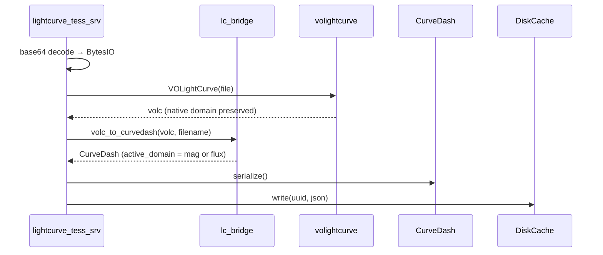
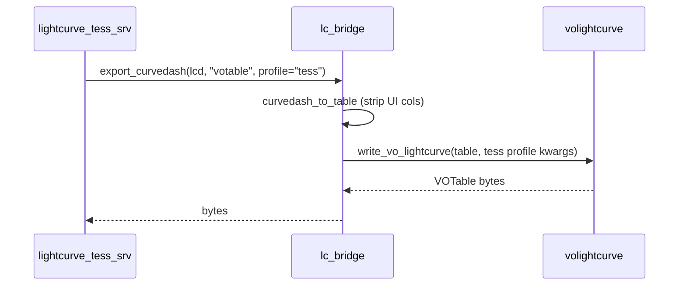
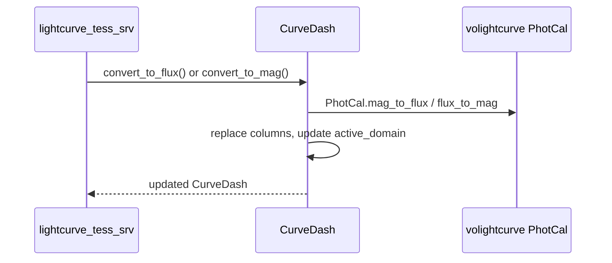

# Lightcurve Data Flow & Layered Architecture

This document describes how lightcurve data is ingested, processed, serialised, stored, and passed across the layers of the `skvo_veb` application. It defines structural boundaries between standard astronomical models, application transport formats, and interactive UI state.

**Last updated:** 2026-07-02 — domain-aware ingestion, bridge export profiles, on-demand conversion.

---

## 1. Layer Responsibilities

| Layer | Module | Knows about | Must NOT know about |
|-------|--------|-------------|---------------------|
| **Scientific core** | `skvo_veb/volightcurve/` | Astropy, IVOA VOTable, photDM, `PhotCal` unit-safe conversions | Dash, Plotly, `CurveDash`, cache keys, TESS pipeline UI |
| **Application bridge** | `skvo_veb/utils/lc_bridge.py` | `VOLightCurve`, `CurveDash`, export profiles | Dash callbacks, HTML layout, component IDs |
| **Application state** | `skvo_veb/utils/curve_dash.py` | Pandas DataFrame, `active_domain`, phase/selection UI columns | VOTable XML construction, Lightkurve queries |
| **Mission / instrument config** | `tess_config.py`, `lc_config.py` | Physical constants, pipeline identifiers | UI, parsing logic |
| **Archive builder** | `skvo_veb/utils/tess_lc_builder.py` | Lightkurve → `CurveDash` (flux domain) | Dash callbacks |
| **UI controller** | `skvo_veb/pages/lightcurve_tess_srv.py` | Callback wiring, cache UUIDs, Plotly figures | Column heuristics, mag↔flux math, VOTable XML |

---

## 2. Photometric Domain Model

Photometry is **never converted automatically** at ingestion. The native domain from the source file is preserved:

| `active_domain` | DataFrame columns | Typical source |
|-----------------|-------------------|----------------|
| `'flux'` | `flux`, `flux_err` | TESS/Lightkurve, flux VOTables |
| `'mag'` | `mag`, `mag_err` | Catalogue magnitude files, mag VOTables |

Metadata fields:

- `metadata['active_domain']` — current storage domain (`'flux'` or `'mag'`)
- `metadata['photcal']` — zero-point calibration copied from `VOLightCurve` at upload time
- `metadata['flux_unit']` / `metadata['mag_unit']` — unit strings for the active domain

### On-demand conversion (CurveDash)

Conversion is explicit and mutates the DataFrame in place:

```python
lcd.convert_to_flux()   # mag → flux, uses PhotCal from metadata
lcd.convert_to_mag()    # flux → mag, uses PhotCal from metadata
```

These delegate to `PhotCal` in `volightcurve/` when possible, with fallback formulas from `lc_config.py`. A future UI callback will call these methods when the user toggles magnitude/flux view.

Accessors for plotting and export:

| Property | Description |
|----------|-------------|
| `lcd.phot` | Values in the active domain |
| `lcd.phot_err` | Uncertainties in the active domain |
| `lcd.phot_unit` | Unit string for the active domain |
| `lcd.flux` | Flux series (only when `active_domain == 'flux'`) |
| `lcd.mag` | Magnitude series (only when `active_domain == 'mag'`) |

---

## 3. Data Flow Diagrams

### 3.1 User upload (file → cache)

```text
  [ Uploaded file (.vot / .dat / .csv) ]
                 |
                 v
         VOLightCurve(file)              ← volightcurve/ (parse, no conversion)
                 |
                 v
         volc_to_curvedash()             ← lc_bridge (JD0, column map, photcal meta)
                 |                         stores mag OR flux as-is
                 v
         CurveDash.serialize()           ← {"lightcurve": {...}, "metadata": {...}}
                 |
                 v
         DiskCache (server-side UUID)
```

### 3.2 TESS archive download (Lightkurve → cache)

```text
  Lightkurve search / download
                 |
                 v
  tess_lc_builder.create_lc_from_selected_rows()   ← flux domain, no conversion
                 |
                 v
         CurveDash.serialize() → DiskCache
```

### 3.3 Export (cache → user file)

```text
  CurveDash.from_serialized(cache)
                 |
                 v
         export_curvedash(lcd, format, profile)
                 |
       +---------+---------+
       |                   |
  format='votable'    other formats
  profile='tess'            |
       |              lcd.download(format)
       v                   |
  curvedash_to_table()     |
  (strip UI cols)          |
       |                   |
       v                   v
  write_vo_lightcurve()   [ ECSV / CSV / FITS / … ]
       |
       v
  [ Compliant VOTable v1.4 ]
```

### 3.4 Optional compact JSON transport (not wired to TESS page)

```text
  VOLightCurve → pack_volc_to_json() → {schema, data, meta}
                                              |
                                              v
                               unpack_json_for_plotly() → NumPy arrays
```

Retained for lightweight cross-service transport; the TESS page plots from `CurveDash.phot` directly.

---

## 4. Bridge Public API (`lc_bridge.py`)

| Function | Purpose |
|----------|---------|
| `read_to_volc(file_source)` | File → `VOLightCurve` |
| `volc_to_curvedash(volc, filename)` | Upload path: VO → `CurveDash`, no domain conversion |
| `curvedash_to_table(lcd)` | Strip UI columns → clean `Table` for export |
| `export_curvedash(lcd, format, profile)` | Unified export entry point |
| `pack_volc_to_json(lc)` | Optional compact JSON transport |
| `unpack_json_for_plotly(json_str, view_mode)` | Optional Plotly-oriented decoder |

Export profiles bundle instrument constants so callbacks do not assemble parameters line-by-line:

| Profile | Use case | Zero points in PhotCal |
|---------|----------|------------------------|
| `tess` | Archive / pipeline lightcurves (`lightcurve_tess_srv`) | SPOC only, omitted when stitched |
| `cutout` | User FFI/TPF aperture photometry (`tess_cutout`) | Never (uncalibrated) |

The **cutout** profile records `cutout_source` (FFI/TPF), `mask_mode` (handmade/threshold/pipeline), and pipeline author **`user`** in table descriptions and PARAM metadata.

---

## 5. Configuration Modules

### `lc_config.py` (mission-agnostic)

- `JD_TO_MJD` — Julian Date offset for Modified Julian Date (2400000.5); `MJD = JD - JD_TO_MJD`
- `DEFAULT_EPOCH_JD` — alias of `JD_TO_MJD`; used for relative JD plot axes
- `FALLBACK_MAG_ZERO_POINT` — used when PhotCal metadata is missing
- `MAG_TO_FLUX_ERR_FACTOR`, `FLUX_TO_MAG_ERR_FACTOR` — fallback error propagation
- `DOMAIN_FLUX`, `DOMAIN_MAG` — domain identifier constants

### `tess_config.py` (TESS-specific)

- Timescale, filter ID, BTJD origin, SPOC zero points
- `is_spoc_pipeline(authors)` — zero-point inclusion rule for export

Import config modules wholesale; do not scatter constants across callbacks.

---

## 6. Strict Phase Omission Rules (VOTable export)

The phase column is useful interactively but **must never** appear in standards-compliant VOTables.

`write_vo_lightcurve` (volightcurve layer) accepts only `Table`, `DataFrame`, or `VOLightCurve` — not `CurveDash`. The bridge calls `curvedash_to_table()` first, which:

1. Maps absolute `jd` → MJD in `obs_time` (`jd - JD_TO_MJD`), active photometry → `phot`, active error → `flux_error`
2. Sets VOTable `TIMESYS/@timeorigin` to `JD_TO_MJD` so `JD = obs_time + timeorigin`
3. Includes optional `label` column (UCD `meta.id;meta.dataset`) for sector colour-coding
4. Omits `selected`, `perm_index`, `phase`, and other UI columns
5. Embeds `sectors`, `flux_origins`, `authors`, and `title` in table metadata for VOTable `<PARAM>` export
6. Passes `period` and `epoch` as table `<PARAM>` elements via export profile kwargs

TESS photometry method (e.g. `pdcsap`, `sap`) appears in the `<TABLE>` description and in `flux_origins` metadata.

**Stitched lightcurves:** sector stitching applies relative flux normalisation, so pipeline photometric zero points must **not** be written to the `<GROUP name="photcal">` block. The TESS export profile omits `zeroPointFlux` and `zeroPointReferenceMagnitude` when `metadata['stitched']` is set (any pipeline). Passband metadata (`filterIdentifier`, `effectiveWavelength`) is still exported.

Plot titles after upload are rebuilt by `build_curvedash_title()` from metadata or restored from the exported `title` PARAM.

### Trim and export window (`lc_interaction.py`)

**`lightcurve_tess_srv` (server cache architecture):**

1. **Box/lasso on the graph** — Plotly draws the selection instantly in the browser (no network).
2. **Clientside bounds capture** — `selectedData.range.x` → `store_tess_lc_srv_selection_bounds` as `{xmin, xmax}` only (~16 bytes). The lightcurve never enters a `dcc.Store`.
3. **Trim selected** — server callback reads bounds + `user_tab_id`, loads curve from DiskCache, calls `trim_curvedash_*`, writes cache back, emits UUID trigger to replot.
4. **Download** — server reads cache, clips with bounds/relayout, streams file (acceptable latency).

**`tess_cutout` (session store architecture):** the curve is already built and held in `store_tess_cutout_lightcurve` for page persistence; clientside trim mutates that local JSON without an extra server round-trip.

Export clipping uses `prepare_lcd_for_export()` on the server (srv) or at download time (cutout).

---

## 7. Module Reference

### A. `skvo_veb/volightcurve/`

Independent VO package. Parses VOTable and heuristic ASCII. Provides `PhotCal.mag_to_flux()` / `flux_to_mag()`. Writes VOTable via `write_vo_lightcurve(table, …)`.

### B. `skvo_veb/utils/lc_bridge.py`

Decouples VO core from Dash app. Single upload path (`volc_to_curvedash`) and single export path (`export_curvedash`).

### C. `skvo_veb/utils/curve_dash.py`

Application state: Pandas DataFrame, `active_domain`, UI columns (`selected`, `perm_index`, `phase`). Serialisation for DiskCache. On-demand `convert_to_flux()` / `convert_to_mag()`. Non-VO export via `download()` (VOTable blocked — use bridge).

### D. `skvo_veb/utils/tess_lc_builder.py`

Lightkurve ingestion for TESS archive download. Always produces flux-domain `CurveDash`.

### E. `skvo_veb/pages/lightcurve_tess_srv.py`

Thin UI controller: upload → bridge, download → `export_curvedash`, plot → `lcd.phot`.

---

## 8. Sequence Diagrams

### Upload



### Export (VOTable)



### Domain conversion (future UI toggle)



---

## 9. Implementation Status

| Item | Status |
|------|--------|
| Domain-aware ingestion (no auto-conversion) | **Done** |
| `CurveDash.convert_to_flux()` / `convert_to_mag()` | **Done** |
| `export_curvedash()` with TESS profile | **Done** |
| `tess_lc_builder.py` extracted from page | **Done** |
| `lc_config.py` centralised defaults | **Done** |
| `write_vo_lightcurve` accepts Table only (not CurveDash) | **Done** |
| UI callback for domain toggle | **Future** |
| Wire `pack_volc_to_json` into plotting path | **Optional / deferred** |
